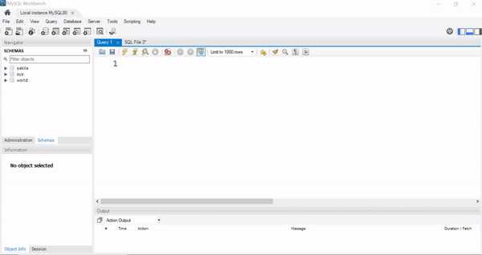
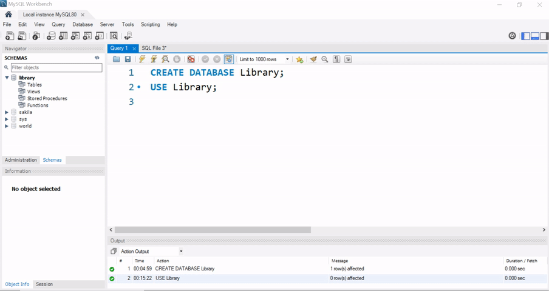

### Introduction to Databases and their Importance:

### 1.1 What is a Database?

**Definition:**

- A database is an organized collection of structured data that is designed to be easily accessed, managed, and updated.

**Importance:**

- Databases play a crucial role in various applications and industries, such as banking, healthcare, e-commerce, and more.
- They provide a structured and efficient way to store, retrieve, and manipulate data.

* **Data Organization and Management**: Databases offer a structured way to organize and manage vast amounts of data. They provide a systematic arrangement of data into tables, rows, and columns, making it easier to access, update, and retrieve information. This organization ensures data integrity and consistency.

* **Efficient Data Retrieval**: Databases enable efficient data retrieval using query languages like SQL. This allows users to specify precisely what data they need and retrieve it quickly, even from large datasets. Searching, filtering, and sorting data become streamlined processes, enhancing productivity.

* **Data Sharing and Collaboration**: Databases facilitate data sharing and collaboration among multiple users or applications. Authorized individuals can access and manipulate the same data simultaneously, ensuring that everyone is working with the most up-to-date information. This is particularly crucial in team environments.

* **Data Security and Integrity**: Databases provide mechanisms to enforce data security and integrity. Access controls can restrict who can view, modify, or delete data. Additionally, databases can implement validation rules and constraints to ensure that only valid and accurate data is stored, reducing the risk of errors.

* **Support for Business Operations**: Databases play a pivotal role in business operations by storing critical information such as customer records, inventory data, financial transactions, and more. With accurate and easily accessible data, businesses can make informed decisions, manage resources effectively, and provide better services to customers.

**1.2 Benefits of Using Databases:**

- **Data Integrity:** Databases enforce data consistency and integrity through constraints and rules.
- **Data Sharing:** Databases enable multiple users to access and manipulate data concurrently.
- **Data Security:** Databases provide mechanisms for access control and data protection.
- **Data Persistence:** Databases ensure long-term storage and availability of data.
- **Data Scalability:** Databases can handle large volumes of data and support growth.

**Overview of MySQL and its Features:**

**1.3 Introduction to MySQL:**

- MySQL is an open-source relational database management system (RDBMS) widely used for web applications and other data-driven software.
- MySQL is known for its performance, scalability, and ease of use.
- It supports various platforms, including Windows, Linux, and macOS.

**1.3.1 Key Features of MySQL:**

- **Data Security:** MySQL offers robust security features, including user authentication, encryption, and access control.
- **ACID Compliance:** MySQL ensures transactional integrity by following ACID (Atomicity, Consistency, Isolation, Durability) properties.
- **Scalability:** MySQL supports scalable architectures and techniques such as replication and sharding.
- **High Performance:** MySQL provides optimization techniques, indexing mechanisms, and query caching for efficient query execution.
- **Data Types:** MySQL supports a wide range of data types, including numeric, string, date/time, and more.
- **Stored Procedures and Functions:** MySQL allows the creation of stored procedures and functions to encapsulate logic and enhance performance.

**1.3.2 Installing and Setting up MySQL:**
**Installing MySQL:**

- Download the latest version of MySQL from the official website (https://www.mysql.com).
- Follow the installation wizard and choose the appropriate options for your operating system.
- Choose the installation type (Typical, Custom).
- Set the root password for the MySQL server.

**Configuring MySQL:**

- Configure port settings and networking options.
- Choose the storage engine (InnoDB, MyISAM, etc.).
- Complete the installation process.

**1.3.3 Setting up MySQL:**

- Start the MySQL server after installation.
- Configure the root user password for administrative access.
- Verify the installation by connecting to the MySQL server using the command-line interface or a GUI tool.

**1.4 Introduction to SQL:**

- Structured Query Language (SQL) is a standard language for interacting with relational databases.
- SQL allows users to perform operations such as querying, inserting, updating, and deleting data.

**1.4.1 Basic SQL Commands**
**A. Data Definition Language (DDL) Commands**
DDL stands for "Data Definition Language" in SQL (Structured Query Language). DDL is a subset of SQL used to **define** and **manage** the structure of a database and its objects. It includes commands that allow you to **create, modify, and delete** database objects such as tables, indexes, views, and schemas. DDL statements do not manipulate the data within the database; instead, they focus on the structure and organization of the data.

- CREATE TABLE: Define a new table's structure.
- ALTER TABLE: Modify an existing table's structure.
- DROP TABLE: Delete a table and its data.
- CREATE DATABASE: Create a new database.
- ALTER DATABASE: Modify database attributes.
- DROP DATABASE: Delete a database and its contents.

**B. Data Manipulation Language (DML) Commands**
Data Manipulation Language (DML) is a subset of SQL (Structured Query Language) that focuses on the **manipulation** and **retrieval** of data stored within a database. DML is used to interact with the data itself rather than the structure of the database objects. It consists of commands that allow you to **insert, update, delete, and retrieve** data from database tables.

- SELECT: Retrieve data from one or more tables.
- INSERT: Add new rows into a table.
- UPDATE: Modify existing data in a table.
- DELETE: Remove rows from a table.

**C. Data Control Language (DCL) Commands**
Data Control Language (DCL) is another subset of SQL (Structured Query Language) that deals with the **authorization and permissions** related to database objects. DCL commands are used to control access to data and database operations by specifying who is allowed to perform certain actions on the data.

The two main DCL commands are:

- GRANT: Assign specific privileges to users or roles.
- REVOKE: Remove specific privileges from users or roles.

## MySQL Data Types

- In MySQL, data types define the kind of values that can be stored in a column of a table.
- Each data type has specific characteristics, such as size, format, and range of values it can hold.
- Understanding MySQL data types is crucial for designing efficient and accurate database schemas.
- Here are some common MySQL data types for beginners:

**Numeric Data Types:**

- INT: Used for storing whole numbers (integers). Can be signed (both positive and negative) or unsigned (only positive).
- TINYINT, SMALLINT, MEDIUMINT, BIGINT: Similar to INT but with varying ranges of values.
- FLOAT, DOUBLE: Used for floating-point numbers (decimals) with varying precision.

**Character String Data Types:**

- CHAR: Fixed-length string with a defined length. Padded with spaces if the data is shorter than the specified length.
- VARCHAR: Variable-length string with a maximum length. More efficient for storage but may have slight performance overhead.
- TEXT: Used for larger textual data, such as paragraphs or documents.

**Date and Time Data Types:**

- DATE: Stores date in 'YYYY-MM-DD' format.
- TIME: Stores time in 'HH:MM:SS' format.
- DATETIME: Stores both date and time in 'YYYY-MM-DD HH:MM:SS' format.
- TIMESTAMP: Similar to DATETIME but can automatically update to the current timestamp on INSERT or UPDATE.

**Boolean Data Type:**

- BOOLEAN, BOOL, TINYINT(1): Used to store true/false or 0/1 values.

**Binary Data Types:**

- BINARY: Fixed-length binary data.
- VARBINARY: Variable-length binary data.
- BLOB: Used for larger binary objects like images or files.

**Enumerated and Set Data Types:**

- ENUM: A list of predefined values. You can choose one value from the list.
- SET: Similar to ENUM, but you can choose multiple values from the list.

**Spatial Data Types:**

- GEOMETRY, POINT, LINESTRING, POLYGON: Used for storing spatial data like maps and geographic coordinates.

**Note**:_Remember that the choice of data type impacts storage requirements, query performance, and data integrity. It's important to select the appropriate data type based on the nature of the data you're storing. Also, keep in mind that some database systems might have variations or additional data types beyond the ones mentioned here. Always refer to the official documentation for the specific version of MySQL you're using._

**1.5 Business Model Problem: Developing a Library Management System**

**Problem Description:**

Limkokwing library management needs to modernize the way they manage their collection, members, and borrowing process of books. The existing manual system is time-consuming, error-prone, and lacks real-time visibility. Your goal is to design and implement a database system that automates various tasks, enhances member experience, and provides data-driven insights for better decision-making.

**Requirements**:

**Book Management:**

- The system should store book details including ISBN, title, author, genre, publication year, and copies available.
- Each book should have a unique identifier (ISBN) and be categorized by genre.
- The system should allow adding new books, updating book information, and keeping track of available copies.

**Member Management:**

- The system should store member details including ID, name, contact information, and membership status.
- Each member should have a unique identifier (ID).
- The system should support registering new members, updating member information, and managing membership status.

**Borrowing Process:**

- Members should be able to borrow books by providing their ID and the book's ISBN.
- The system should maintain borrowing history, including the borrowing date, due date, and return date.
- It should prevent members from borrowing more copies of a book than available.
- The system should handle returns and calculate any overdue fines.

**Reporting and Insights:**

- The system should generate reports on book availability, member borrowing history, and overdue fines.
- Reports should help administrators make informed decisions about purchasing new books and managing library operations.


**Step-by-Step Solution:**

**Identification of Entities and Attributes:**

**Book:**

- ISBN (Primary Key)
- Title
- Author
- Genre
- Publication Year
- Copies Available

**Member:**

- ID (Primary Key)
- Name
- Contact Information
- Membership Status

**Borrowing:**

- BorrowingID (Primary Key)
- MemberID (Foreign Key referencing Member)
- ISBN (Foreign Key referencing Book)
- Borrowing Date
- Due Date
- Return Date

**Keys**
- ISBN
-  ID
- BorrowingID

**Relationships:**

- A Book can be borrowed by multiple Members (One-to-Many: Book to Borrowing).
- A Member can borrow multiple Books (One-to-Many: Member to Borrowing).

### MySQL Implementation

**Step 1: Creating the Database and Connecting**

- Connect to MySQL Server: Open your MySQL command-line client and enter your credentials to connect to the MySQL server.
- Create Database: Use the following command to create a new database named "Librabry":

```sql
CREATE DATABASE library;
```

**Use Database: Switch to the newly created database:**

```sql
USE library;
```

**Step 2: Creating Tables (DDL Commands)**

- Creating the "Book" Table:

```sql
CREATE TABLE books (
    ISBN VARCHAR(13) PRIMARY KEY,
    Title VARCHAR(100),
    Author VARCHAR(50),
    Genre VARCHAR(50),
    PublicationYear INT,
    CopiesAvailable INT
);
```

**Explanation:**

- ISBN: Unique identifier for each book.
- Title: Title of the book.
- Author: Author of the book.
- Genre: Book genry.
- PublicationYear: Year of Publication of the book
- CopiesAvailable:Copies of books available

```sql
CREATE TABLE members (
    MemberID INT AUTO_INCREMENT PRIMARY KEY,
    Name VARCHAR(100),
    ContactInfo VARCHAR(100),
    MembershipStatus VARCHAR(20)
);
```

**Explanation:**

- MemberID: Unique identifier for each member;
- Name: Name of the member
- ContactInfo: ContactInfo of the member
- MembershipStatus: the status of each member

```sql
CREATE TABLE borrowings (
    BorrowingID INT AUTO_INCREMENT PRIMARY KEY,
    MemberID INT,
    ISBN VARCHAR(13),
    BorrowingDate DATE,
    DueDate DATE,
    ReturnDate DATE,
    FOREIGN KEY (MemberID) REFERENCES members(MemberID),
    FOREIGN KEY (ISBN) REFERENCES books(ISBN)
);
```

- BorrowingID: Unique identifier for each borrowing;
- MemberID: Foreign key from Member table
- ISBN: Foreign Key from Book table
- BorrowingDate: Date the book was borrowed
- DueDate:
- ReturnDate:

**Explanation**

- We create a new database named library_management.
- We define three tables: Book, Member, and Borrowing, each with its specified attributes and data types.
- We use primary keys and foreign keys to establish relationships between tables.

**INSERT Statement: Insert sample books**

- The INSERT statement is used to insert new rows into a table.
- Syntax:

```sql
INSERT INTO table_name (column1, column2) VALUES (value1, value2)
```


**Step 3: Inserting Data (DML Commands)**

- Inserting Books into the "Book" Table:

```sql
INSERT INTO books(ISBN,Title, Author, Genre, PublicationYear, CopiesAvailable) 
VALUES (101, "Database Systems", "Alpha Alimamy", "Technology", 2023, 10);
```

**Explanation**:

- This command inserts sample books into the "Book" table.

**INSERTING MULTIPLE VALUES**

```sql
INSERT INTO books  VALUES (102, "HCI", "Santigie", "Technology", 2020, 12),
						 (103, "Maths", "Mr. Abass", "Maths", 2020, 15),
                         (104, "AI", "Mr. Leigh", "AI", 2021, 20),
                         (105, "HW", "Mr. Aruna", "CS", 2020, 12);
```

**CLASS EXERCISE**
1. Add 20 records in the books table. An author can write more than a book


**Insert sample members**

```sql
INSERT INTO members (Name, ContactInfo, MembershipStatus)
VALUES
    (''Alpha', 'alpha@gmail.com', 'Active'),
    ('Leigh Omar', 'leigh@gmail.com', 'Active');
```

**CLASS EXERCISE**
1. Add 20 records in the members table. 

```sql
INSERT INTO borrowings (MemberID, ISBN, BorrowingDate, DueDate)
VALUES
    (1, '101', '2023-08-15', '2023-08-30'),
    (2, '102', '2023-08-10', '2023-08-25');
```

**Explanation**:

We use INSERT INTO statements to populate the tables with sample data.
Sample data includes books, members, and borrowing records.

**CLASS EXERCISE**
1. Add 20 records in the borrowings table.

### QUERYING THE DATABASE

**SELECT Statement:**

**Step 4: Querying Data (DML Commands)**

- The SELECT statement is used to retrieve data from one or more tables.
- Syntax:

```sql
SELECT column1, column2 FROM table_name WHERE condition;
```

**Problem 1: List all available books**

```sql
SELECT * FROM books;
```

**Explanation:**

- This query retrieves all the books available.


**Problem 2: Select the Title, Author from the books table**

```sql
SELECT Title, Author FROM books;
```

**CLASS EXERCISE**
1. Select the Title, Author and PublicationYear from the books
2.  Select Title, Author and AvailableCopies

**Problem 3: List all  members from the members table**

```sql
SELECT * FROM members;
```

**The SELECT statement can also be used with the WHERE clause to filtering records base on a certain condition**

`SELECT (column1, column2 etc) FROM table_name WHERE condition`


**Problem 3: List all  active members from the members table**
```sql
SELECT * FROM members WHERE MembershipStatus = 'Active';
```
**Explanation**
1. table name : **members**
2. `*` means select all columns
3.  Condition:  **MembershipStatus = "Active"**

**UPDATE Statement:**

- The UPDATE statement is used to modify existing data in a table.

- Syntax:

```sql
 UPDATE table_name
 SET column1 = value1, column2 = value2
 WHERE condition
```

**Updating Book Information**

**Step 1: Identify the Book to Update**

- In this case, let's update the title of the book with ISBN '101'.

**Step 2: Use the UPDATE Statement**

```sql
UPDATE Book
SET Title = 'Business Management'
WHERE ISBN = 101;
```

**Explanation**:

- `UPDATE Book` specifies the table you want to update, which is the `Book` table in this case.
- `SET Title = 'New Title'` sets the new value for the `Title` column.
- `WHERE ISBN = 101 ` specifies the condition to identify the specific book to update based on its ISBN.

**Problem 4: Changing Member Contact Information**

Let's assume a member has changed their contact information, and you need to update it in the database.

**Step 1: Identify the Member to Update**

- In this case, let's update the contact information for the member with ID 1.

```sql
UPDATE Member
SET ContactInformation = 'newemail@example.com'
WHERE ID = 1;
```

**Explanation**:

- `UPDATE Member` specifies the table you want to update, which is the Member table in this case.
- `SET ContactInformation = 'mayakie@gmail.com'` updates the ContactInformation column.
- `WHERE ID = 2` specifies the condition to identify the specific member to update based on their ID.

**Example 3: Extending the Due Date for a Borrowing**

- Let's assume you need to extend the due date for a borrowing.

**Step 1: Identify the Borrowing to Update**

- In this case, let's extend the due date for the borrowing with BorrowingID 2.

**Step 2: Use the UPDATE Statement**

```sql
UPDATE Borrowing
SET DueDate = '2023-09-05'
WHERE BorrowingID = 2;
```

**Explanation**:

- `UPDATE Borrowing` specifies the table you want to update, which is the Borrowing table in this case.
- `SET DueDate = '2023-09-05'` updates the DueDate column to the new date. -` WHERE BorrowingID = 2` specifies the condition to identify the specific borrowing to update based on its BorrowingID.

**DELETE Statement:**

- The DELETE statement is used to remove rows from a table.
- Syntax:

```sql
  DELETE FROM table_name WHERE condition;
```

**Step 5: Example 1: Deleting a Book Record**

- Delete a book record based on ISBN

```sql
DELETE FROM Book WHERE ISBN = 101;
```

**Explanation**:

- The `DELETE ` statement is used to remove records from a table.
- The `WHERE` clause specifies the condition for which records to delete. In this case, we're deleting the book with the specified ISBN.

**Example 2: Deleting a Member Record**

- Delete a member record based on ID

```sql
DELETE FROM Member WHERE ID = 1;
```

**Explanation**:

- Similar to the previous example, we're using the DELETE statement with a WHERE clause to delete a member record based on the specified ID.

**Example 3: Deleting a Borrowing Record**

- Delete a borrowing record based on BorrowingID

```sql
DELETE FROM Borrowing WHERE BorrowingID = 1;

```

**Explanation**:

- In this example, we're using the DELETE statement to remove a borrowing record based on the provided BorrowingID.
- In all three examples, the DELETE statement is applied to the respective tables (Book, Member, Borrowing), and the WHERE clause specifies the condition for deletion.

**Remember**:

- Be cautious when using the DELETE statement as it permanently removes records from the table.
- Ensure you use the correct condition in the WHERE clause to target the specific record(s) you want to delete.

**Note**:

- Since deletion of records from your database is permanent and irreversible, make sure to test these statements on a non-production environment or with sample data to avoid accidental data loss.

### SELECT STATEMENT

**Exercise 1: List Books of a Specific Genre**

- Given the Book table, retrieve the titles and authors of all books in the 'Fiction' genre.

**Exercise 2: Active Members List**

- In the Member table, select the names and contact information of all members with an 'Active' membership status.

**Exercise 3: Overdue Borrowings**

- From the Borrowing table, identify the names of members who have overdue books (Return Date is past the Due Date) along with the book titles and overdue days.

**Exercise 4: Member Borrowing History**

- For a specific member (you can use ID), retrieve a list of book titles they have borrowed, along with the borrowing and return dates.

**Exercise 5: Available Books Count**

- Calculate the total count of books available for each genre in the library using the Book table.

### Delete Statement

**Exercise 1: Deleting Books**
Given the Book table with attributes (ISBN, Title, Author, Genre, Publication Year, Copies Available), write a MySQL query to delete the book with the ISBN '9780140326095'.

**Exercise 2: Removing Inactive Members**

In the Member table with attributes (ID, Name, Contact Information, Membership Status), delete all records of members who have an 'Inactive' membership status.

**Exercise 3: Reversing Borrowings**
In the Borrowing table with attributes (BorrowingID, MemberID, ISBN, Borrowing Date, Due Date, Return Date), delete a borrowing record where the Due Date has passed and the Return Date is not null.

**Exercise 4: Managing Book Copies**

Imagine you need to remove a book from the library's collection. Write a MySQL query to delete a book record and update the Copies Available for all remaining copies of that book.

**Exercise 5: Cleanup Borrowing History**

In the Borrowing table, delete all records where the Return Date is earlier than the Borrowing Date.

### ASSIGNMENT

**Business Problem 1: Health Center Management**

**Problem**: A health center maintains a database to track patient appointments, doctors, and medical history. Help the health center retrieve necessary information for better patient management.

**Queries:**

- List all patients who have appointments today.
- Find the total number of appointments scheduled for each doctor.
- Retrieve the names of patients who have a specific medical condition (e.g., diabetes).
- Identify doctors who have the highest number of appointments.
- Calculate the average age of patients visiting the health center.

**Business Problem 2: Educational Institution**
**Problem**: An educational institution stores information about students, courses, and grades. Assist the institution in extracting useful insights for academic planning.

**Queries**:

- List the names of students who have achieved the highest grade in a specific course.
- Retrieve the courses that have the lowest enrollment.
- Calculate the average GPA of students.
- Find the students who are enrolled in multiple courses.
- Identify courses with the highest drop-out rates.

**Business Problem 3: Inventory Management**

**Problem**: An inventory management system records details about products, suppliers, and stock levels. Help the business analyze inventory data for efficient stock management.

**Queries**:

- List products that are running low on stock (quantity less than a certain threshold).
- Retrieve the names of suppliers who provide products with the highest profit margin.
- Calculate the total value of the inventory.
- Identify products that have not been sold in the last month.
- List products with the highest sales revenue.
