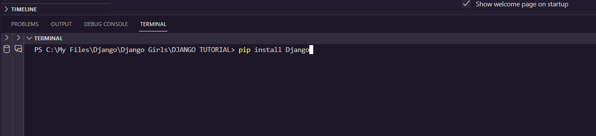
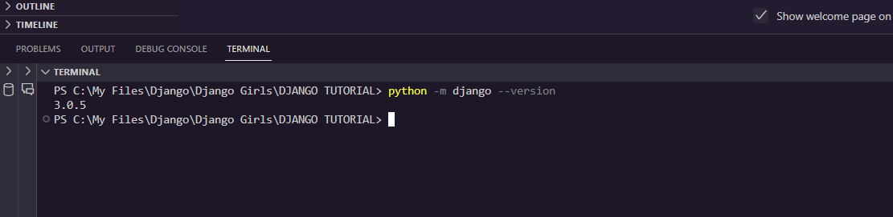
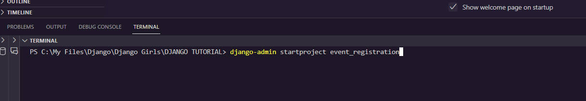
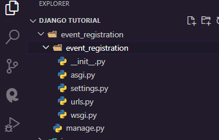
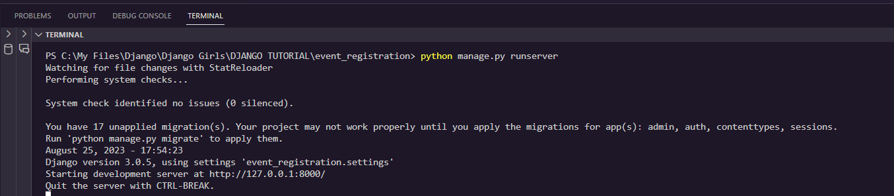
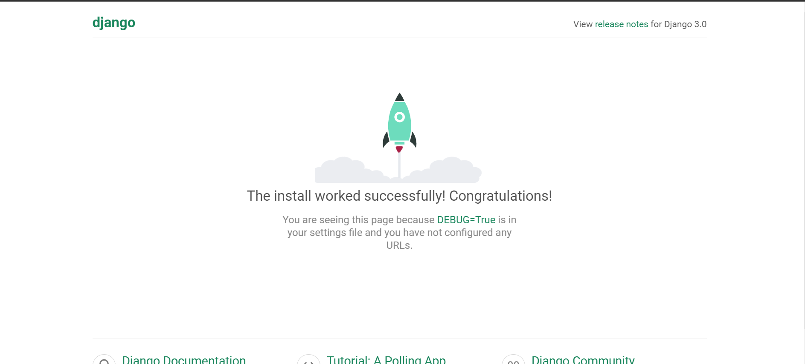
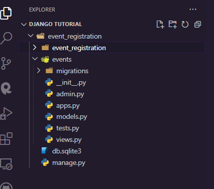

**What is Django? **

Django is a high-level Python web framework that simplifies web development by providing various tools and libraries for common tasks.

**Who uses Django?**

Django is used by developers and organizations of all sizes to build robust and scalable web applications.

**Why use Django? **

Django offers a clean and efficient approach to web development. It follows the DRY (Don't Repeat Yourself) principle and encourages rapid development with its built-in features.

**Installation**
To install Django:

1. Open the terminal 


2. run: 

```python
pip install Django
```




check Django version

```python
python -m django --version
```



Setup:

Create a new Django project:

```python
django-admin startproject event_registration
```



Navigate to the project directory 

```python
cd event_registration
```



Run Server:

```python
python manage.py runserver
```




Access the server in your web browser: [http://127.0.0.1:8000/](http://127.0.0.1:8000/)




Create an app

```python
python manage.py startapp events
```



**Include the app in the settings.py**

- Navigate to settings.py in the project
- Go to INSTALLED_APPS

```python

INSTALLED_APPS = [
    'django.contrib.admin',
    'django.contrib.auth',
    'django.contrib.contenttypes',
    'django.contrib.sessions',
    'django.contrib.messages',
    'django.contrib.staticfiles',
    
    "events"
]
```