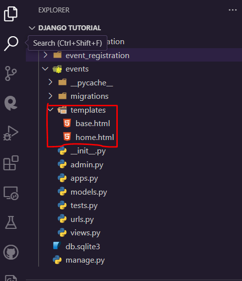

**Templates**

- HTML files with placeholders for dynamic content.

**Template Inheritance**

Allows creating a base template with common structure.

**Creating Templates**

- Create templates folder in the events app directory
- Design **base.html**



```html
<!DOCTYPE html>
<html>
  <head>
    <title>Event Registration</title>
  </head>

  <body>
     
  </body>
</html>
```

**Using Templates**

- Extend base.html in other templates
- Create a new template called **home.html**
- Extend **home.html** in it

```html
 

<h1>Upcoming Events</h1>
<ul>
  <li>Frontend Hackathon</li>
  <li>Backend Hackathon</li>
</ul>

```
