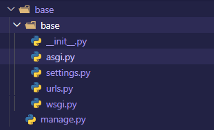
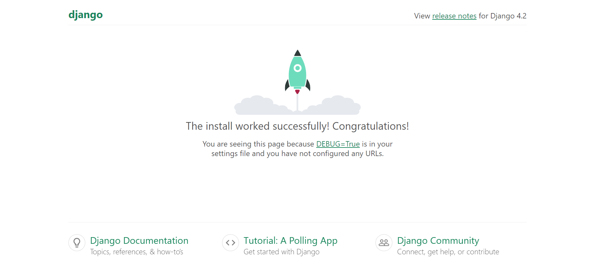
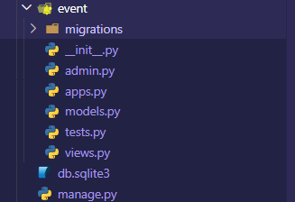
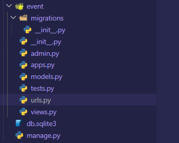

## Writing your first Django app, part 1
Let’s learn by example.

Throughout this tutorial, we’ll walk you through the creation of a basic poll application.

It’ll consist of two parts:

- A public site that lets people view polls and vote in them.
- An admin site that lets you add, change, and delete polls.
- We’ll assume you have Django installed already. You can tell Django is installed and which version by running the following command in a shell prompt:

```python
python -m django --version
```

### Creating a project
If this is your first time using Django, you’ll have to take care of some initial setup. Namely, you’ll need to auto-generate some code that establishes a Django project – a collection of settings for an instance of Django, including database configuration, Django-specific options and application-specific settings.

From the command line, cd into a directory where you’d like to store your code, then run the following command:

```python
django-admin startproject base
```
This will create a `base` directory in your current directory




These files are:

- The outer base/ root directory is a container for your project. Its name doesn’t matter to Django; you can rename it to anything you like.
- `manage.py`: A command-line utility that lets you interact with this Django project in various ways. You can read all the details about manage.py in django-admin and manage.py.
- The inner base/ directory is the actual Python package for your project. Its name is the Python package name you’ll need to use to import anything inside it (e.g. base.urls).
- `base/__init__.py`: An empty file that tells Python that this directory should be considered a Python package. If you’re a Python beginner, read more about packages in the official Python docs.
- `base/settings.py`: Settings/configuration for this Django project. Django settings will tell you all about how settings work.
- `base/urls.py`: The URL declarations for this Django project; a “table of contents” of your Django-powered site. You can read more about URLs in URL dispatcher.
- `base/asgi.py`: An entry-point for ASGI-compatible web servers to serve your project. See How to deploy with [ASGI](https://asgi.readthedocs.io/en/latest/#)  for more details.
- `base/wsgi.py`: An entry-point for WSGI-compatible web servers to serve your project. See How to deploy with WSGI for more details.

## The development server¶
Let’s verify your Django project works. Change into the outer `event` directory, if you haven’t already, and run the following commands:
```python
py manage.py runserver
```


**You’ll see the following output on the command line**

```
Performing system checks...

System check identified no issues (0 silenced).

You have 18 unapplied migration(s). Your project may not work properly until you apply the migrations for app(s): admin, auth, contenttypes, sessions.
Run 'python manage.py migrate' to apply them.
August 13, 2023 - 16:30:37
Django version 4.2.4, using settings 'event.settings'
Starting development server at http://127.0.0.1:8000/
Quit the server with CTRL-BREAK.
```

You’ve started the Django development server, a lightweight web server written purely in Python. We’ve included this with Django so you can develop things rapidly, without having to deal with configuring a production server – such as Apache – until you’re ready for production.

Now’s a good time to note: don’t use this server in anything resembling a production environment. It’s intended only for use while developing. (We’re in the business of making web frameworks, not web servers.)

Now that the server’s running, visit http://127.0.0.1:8000/ with your web browser. You’ll see a “Congratulations!” page, with a rocket taking off. It worked!





### Creating the Event app

Now that your environment – a `project` – is set up, you’re set to start doing work.

Each application you write in Django consists of a Python package that follows a certain convention. Django comes with a utility that automatically generates the basic directory structure of an app, so you can focus on writing code rather than creating directories.

```
Projects vs. apps

What’s the difference between a project and an app? An app is a web application that does something – e.g., a blog system, a database of public records or a small poll app. A project is a collection of configuration and apps for a particular website. A project can contain multiple apps. An app can be in multiple projects.
```

Your apps can live anywhere on your Python path. In this tutorial, we’ll create our `event` app in the same directory as your manage.py file so that it can be imported as its own top-level module, rather than a submodule of `base`.

To create your app, make sure you’re in the same directory as manage.py and type this command:

```python
py manage.py startapp event
```
That’ll create a directory `event`, which is laid out like this:




This directory structure will house the poll application.
## Write your first view

```python
from django.shortcuts import HttpResponse

def index(request):
    return HttpResponse("Hello, world. You're at the event index.")
```

This is the simplest view possible in Django. To call the view, we need to map it to a URL - and for this we need a URLconf.

To create a URLconf in the event directory, create a file called urls.py. Your app directory should now look like:



In the **event/urls.py** file include the following code:

```python
from django.urls import path

from . import views

urlpatterns = [
    path("", views.index, name="index"),
]
```

The next step is to point the root URLconf at the polls.urls module. In `event/urls.py`, add an import for django.urls.include and insert an include() in the urlpatterns list, so you have:

```python
from django.contrib import admin
from django.urls import include, path

urlpatterns = [
    path("", include("event.urls")),
    path("admin/", admin.site.urls),
]
```

The include() function allows referencing other URLconfs. Whenever Django encounters include(), it chops off whatever part of the URL matched up to that point and sends the remaining string to the included URLconf for further processing.

The idea behind include() is to make it easy to plug-and-play URLs. Since polls are in their own event URLconf (urls.py)

`When to use include()`
`You should always use include() when you include other URL patterns. admin.site.urls is the only exception to this.`


You have now wired an index view into the URLconf. Verify it’s working with the following command:
`py manage.py runserver`

Go to http://localhost:8000/ in your browser, and you should see the text “Hello, world. You’re at the event index.”, which you defined in the index view.

The **path()** function is passed four arguments, two required: **route** and **view**, and two optional: **kwargs**, and **name**. At this point, it’s worth reviewing what these arguments are for.


### path() argument: route
route is a string that contains a URL pattern. When processing a request, Django starts at the first pattern in urlpatterns and makes its way down the list, comparing the requested URL against each pattern until it finds one that matches.

Patterns don’t search GET and POST parameters, or the domain name. For example, in a request to` https://www.example.com/myapp/`, the URLconf will look for myapp/. In a request to `https://www.example.com/myapp/?page=3`, the URLconf will also look for myapp/.

### path() argument: view
When Django finds a matching pattern, it calls the specified view function with an HttpRequest object as the first argument and any “captured” values from the route as keyword arguments. We’ll give an example of this in a bit.

### path() argument: kwargs
Arbitrary keyword arguments can be passed in a dictionary to the target view. We aren’t going to use this feature of Django in the tutorial.

### path() argument: name
Naming your URL lets you refer to it unambiguously from elsewhere in Django, especially from within templates. This powerful feature allows you to make global changes to the URL patterns of your project while only touching a single file.

When you’re comfortable with the basic request and response flow, read part 2 of this tutorial to start working with the database.


