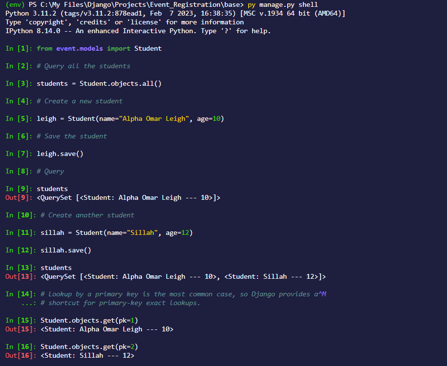
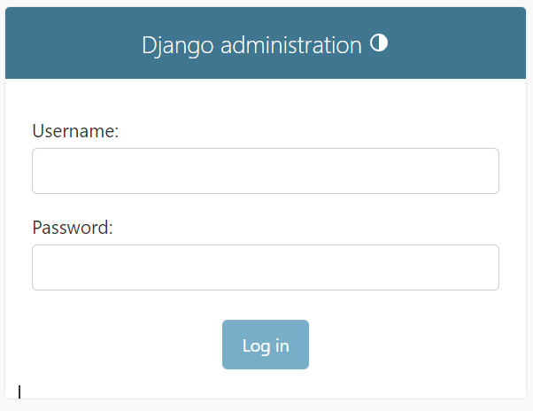
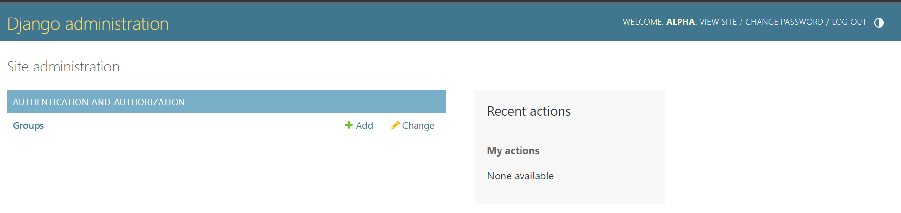
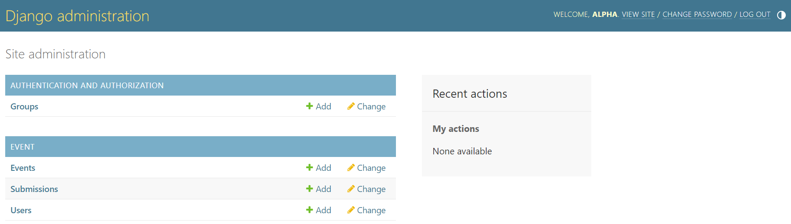

### Writing your first Django app, part 2

This tutorial begins where Tutorial 1 left off. We’ll set up the database, create your first model, and get a quick introduction to Django’s automatically-generated admin site.


### Database setup
Now, open up `base/settings.py`. It’s a normal Python module with module-level variables representing Django settings.

By default, the configuration uses SQLite. If you’re new to databases, or you’re just interested in trying Django, this is the easiest choice. SQLite is included in Python, so you won’t need to install anything else to support your database. When starting your first real project, however, you may want to use a more scalable database like PostgreSQL, to avoid database-switching headaches down the road.

If you wish to use another database, install the appropriate database bindings and change the following keys in the `DATABASES` 'default' item to match your database connection settings:

- `ENGINE` – Either 'django.db.backends.sqlite3', 'django.db.backends.postgresql', 'django.db.backends.mysql', or 'django.db.backends.oracle'. Other backends are also available.
- `NAME` – The name of your database. If you’re using SQLite, the database will be a file on your computer; in that case, `NAME` should be the full absolute path, including filename, of that file. The default value, `BASE_DIR` / `'db.sqlite3'`, will store the file in your project directory.


If you are not using SQLite as your database, additional settings such as `USER`, `PASSWORD`, and `HOST` must be added. For more details, see the reference documentation for DATABASES.


While you’re editing `base/settings.py`, set TIME_ZONE to your time zone.

Also, note the `INSTALLED_APPS` setting at the top of the file. That holds the names of all Django applications that are activated in this Django instance. Apps can be used in multiple projects, and you can package and distribute them for use by others in their projects.

By default, `INSTALLED_APPS` contains the following apps, all of which come with Django:

- `django.contrib.admin` – The admin site. You’ll use it shortly.
- `django.contrib.auth` – An authentication system.
- `django.contrib.contenttypes` – A framework for content types.
- `django.contrib.sessions` – A session framework.
- `django.contrib.messages` – A messaging framework.
- `django.contrib.staticfiles` – A framework for managing static files.

These applications are included by default as a convenience for the common case.

Some of these applications make use of at least one database table, though, so we need to create the tables in the database before we can use them. To do that, run the following command:
`py manage.py migrate`

The migrate command looks at the `INSTALLED_APPS` setting and creates any necessary database tables according to the database settings in your mysite/settings.py file and the database migrations shipped with the app (we’ll cover those later). You’ll see a message for each migration it applies. If you’re interested, run the command-line client for your database and type \dt (PostgreSQL), `SHOW TABLES`; (MariaDB, MySQL), .tables (SQLite), or `SELECT TABLE_NAME FROM USER_TABLES`; (Oracle) to display the tables Django created.

```
For the minimalists

Like we said above, the default applications are included for the common case, but not everybody needs them. If you don’t need any or all of them, feel free to comment-out or delete the appropriate line(s) from INSTALLED_APPS before running migrate. The migrate command will only run migrations for apps in INSTALLED_APPS.
```

### `Creating models`

```

Philosophy

A model is the single, definitive source of information about your data. It contains the essential fields and behaviors of the data you’re storing. Django follows the DRY Principle. The goal is to define your data model in one place and automatically derive things from it.

This includes the migrations - unlike in Ruby On Rails, for example, migrations are entirely derived from your models file, and are essentially a history that Django can roll through to update your database schema to match your current models.```


In our evemt app, we’ll create three models: `User`, `Event` and `Submission`. 

These concepts are represented by Python classes as shown below:


```
```python
from email.policy import default
from django.db import models
from django.contrib.auth.models import AbstractUser
from django_resized import ResizedImageField


### `User Model`
 **Create your models here.**'
 
```
### `Event Model`
```python
class User(AbstractUser):
    name = models.CharField(max_length=100, null=True)
    email = models.EmailField(unique=True, null=True)
    bio = models.TextField(null=True, blank=True)
    hackathon_participant = models.BooleanField(default=True, null=True)

    avatar = ResizedImageField(size=[300,300], default='avatar.png')

    USERNAME_FIELD = 'email'
    REQUIRED_FIELDS = ['username']

    twitter = models.URLField(max_length=500, null=True, blank=True)
    linkedin = models.URLField(max_length=500, null=True, blank=True)
    website = models.URLField(max_length=500, null=True, blank=True)
    facebook = models.URLField(max_length=500, null=True, blank=True)
    github = models.URLField(max_length=500, null=True, blank=True)

    class Meta:
        ordering = ['avatar']
```

### `Event Model`
```python

class Event(models.Model):
    name = models.CharField(max_length=200)
    preview = models.TextField(null=True, blank=True)
    description = models.TextField(null=True, blank=True)
    participants = models.ManyToManyField(User, blank=True, related_name='events')
    start_date = models.DateTimeField(null=True)
    end_date = models.DateTimeField(null=True)
    registration_deadline = models.DateTimeField(null=True)
    updated = models.DateTimeField(auto_now=True)
    created = models.DateTimeField(auto_now_add=True)

    def __str__(self):
        return self.name

    class Meta:
        ordering = ['-end_date']
```

### `Submission Model`
```python
class Submission(models.Model):
    participant = models.ForeignKey(User, on_delete=models.SET_NULL, null=True, related_name="submissions")
    event = models.ForeignKey(Event, on_delete=models.SET_NULL, null=True)
    details = models.TextField(null=True, blank=False)

    def __str__(self):
        return str(self.event) + ' --- ' + str(self.participant)
```


Here, each model is represented by a class that subclasses django.db.models.Model. Each model has a number of class variables, each of which represents a database field in the model.

Each field is represented by an instance of a Field class – e.g., CharField for character fields and DateTimeField for datetimes. This tells Django what type of data each field holds.

### `Error`
`You will see this error on the terminal. `
``` 
from django_resized import ResizedImageField
ModuleNotFoundError: No module named 'django_resized'

```
This is caused by from django_resized import ResizedImageField . You can correct it using the command:

```pip install django-resized```


Visit the documentation for more details [django-resized](https://pypi.org/project/django-resized/)


### `Second Error`


```
from PIL import Image, ImageFile, ImageOps, ExifTags
ModuleNotFoundError: No module named PIL
```


### Solution
```pip install Pillow```


### Third Error

```
SystemCheckError: System check identified some issues:

ERRORS:
auth.User.groups: (fields.E304) Reverse accessor 'Group.user_set' for 'auth.User.groups' clashes with reverse accessor for 'event.User.groups'.
        HINT: Add or change a related_name argument to the definition for 'auth.User.groups' or 'event.User.groups'.
auth.User.user_permissions: (fields.E304) Reverse accessor 'Permission.user_set' for 'auth.User.user_permissions' clashes with reverse accessor for 'event.User.user_permissions'.
        HINT: Add or change a related_name argument to the definition for 'auth.User.user_permissions' or 'event.User.user_permissions'.
event.User.groups: (fields.E304) Reverse accessor 'Group.user_set' for 'event.User.groups' clashes with reverse accessor for 'auth.User.groups'.
        HINT: Add or change a related_name argument to the definition for 'event.User.groups' or 'auth.User.groups'.
event.User.user_permissions: (fields.E304) Reverse accessor 'Permission.user_set' for 'event.User.user_permissions' clashes with reverse accessor for 'auth.User.user_permissions'.
        HINT: Add or change a related_name argument to the definition for 'event.User.user_permissions' or 'auth.User.user_permissions'.

```

`Solution`

include this on the seetings

`AUTH_USER_MODEL = 'event.User'`

### `Activating models`
That small bit of model code gives Django a lot of information. With it, Django is able to:

- Create a database schema (CREATE TABLE statements) for this app.
- Create a Python database-access API for accessing Question and Choice objects.
But first we need to tell our project that the polls app is installed.


```
💡Philosophy

Django apps are “pluggable”: You can use an app in multiple projects, and you can distribute apps, because they don’t have to be tied to a given Django installation.
```

To include the app in our project, we need to add a reference to its configuration class in the `INSTALLED_APPS` setting. The PollsConfig class is in the `base/apps.py` file, so its dotted path is `event.apps.PollsConfig`. Edit the `base/settings.py` file and add that dotted path to the `INSTALLED_APPS` setting. It’ll look like this:


```python
INSTALLED_APPS = [
    'django.contrib.admin',
    'django.contrib.auth',
    'django.contrib.contenttypes',
    'django.contrib.sessions',
    'django.contrib.messages',
    'django.contrib.staticfiles',
    
    'event'
]
```

Now Django knows to include the event app. Let’s run another command:


`py manage.py makemigrations`


You should see something similar to the following:

```
Migrations for 'event':
  event\migrations\0001_initial.py
    - Create model User
    - Create model Event
    - Create model Submission
```

By running `makemigrations`, you’re telling Django that you’ve made some changes to your models (in this case, you’ve made new ones) and that you’d like the changes to be stored as a migration.

Migrations are how Django stores changes to your models (and thus your database schema) - they’re files on disk. You can read the migration for your new model if you like; it’s the file `event/migrations/0001_initial.py`. Don’t worry, you’re not expected to read them every time Django makes one, but they’re designed to be human-editable in case you want to manually tweak how Django changes things.

There’s a command that will run the migrations for you and manage your database schema automatically - that’s called `migrate`, and we’ll come to it in a moment - but first, let’s see what SQL that migration would run. The sqlmigrate command takes migration names and returns their SQL:

` py manage.py sqlmigrate event 0001`

You should see something similar to the following (we’ve reformatted it for readability):

```
BEGIN;
--
-- Create model User
--
CREATE TABLE "event_user" ("id" integer NOT NULL PRIMARY KEY AUTOINCREMENT, "password" varchar(128) NOT NULL, "last_login" datetime NULL, "is_superuser" bool NOT NULL, "username" varchar(150) NOT NULL UNIQUE, "first_name" 
varchar(150) NOT NULL, "last_name" varchar(150) NOT NULL, "is_staff" bool NOT NULL, "is_active" bool NOT NULL, "date_joined" datetime NOT NULL, "name" varchar(100) NULL, "email" varchar(254) NULL UNIQUE, "bio" text NULL, "hackathon_participant" bool NULL, "avatar" varchar(100) NOT NULL, "twitter" varchar(500) NULL, "linkedin" varchar(500) NULL, "website" varchar(500) NULL, "facebook" varchar(500) NULL, "github" varchar(500) NULL);
CREATE TABLE "event_user_groups" ("id" integer NOT NULL PRIMARY KEY AUTOINCREMENT, "user_id" bigint NOT NULL REFERENCES "event_user" ("id") DEFERRABLE INITIALLY DEFERRED, "group_id" integer NOT NULL REFERENCES "auth_group" ("id") DEFERRABLE INITIALLY DEFERRED);
CREATE TABLE "event_user_user_permissions" ("id" integer NOT NULL PRIMARY KEY AUTOINCREMENT, "user_id" bigint NOT NULL REFERENCES "event_user" ("id") DEFERRABLE INITIALLY DEFERRED, "permission_id" integer NOT NULL REFERENCES "auth_permission" ("id") DEFERRABLE INITIALLY DEFERRED);
--
-- Create model Event
--
CREATE TABLE "event_event" ("id" integer NOT NULL PRIMARY KEY AUTOINCREMENT, "name" varchar(200) NOT NULL, "preview" text NULL, "description" text NULL, "start_date" datetime NULL, "end_date" datetime NULL, "registration_deadline" datetime NULL, "updated" datetime NOT NULL, "created" datetime NOT NULL);
CREATE TABLE "event_event_participants" ("id" integer NOT NULL PRIMARY KEY AUTOINCREMENT, "event_id" bigint NOT NULL REFERENCES "event_event" ("id") DEFERRABLE INITIALLY DEFERRED, "user_id" bigint NOT NULL REFERENCES "event_user" ("id") DEFERRABLE INITIALLY DEFERRED);
--
-- Create model Submission
--
CREATE TABLE "event_submission" ("id" integer NOT NULL PRIMARY KEY AUTOINCREMENT, "details" text NULL, "event_id" bigint NULL REFERENCES "event_event" ("id") DEFERRABLE INITIALLY DEFERRED, "participant_id" bigint NULL REFERENCES "event_user" ("id") DEFERRABLE INITIALLY DEFERRED);
CREATE UNIQUE INDEX "event_user_groups_user_id_group_id_eea40f98_uniq" ON "event_user_groups" ("user_id", "group_id");
CREATE INDEX "event_user_groups_user_id_7c878b36" ON "event_user_groups" ("user_id");
CREATE INDEX "event_user_groups_group_id_6cce7f3f" ON "event_user_groups" ("group_id");
CREATE UNIQUE INDEX "event_user_user_permissions_user_id_permission_id_da82fabe_uniq" ON "event_user_user_permissions" ("user_id", "permission_id");
CREATE INDEX "event_user_user_permissions_user_id_240f520e" ON "event_user_user_permissions" ("user_id");
CREATE INDEX "event_user_user_permissions_permission_id_d7516f6d" ON "event_user_user_permissions" ("permission_id");
CREATE UNIQUE INDEX "event_event_participants_event_id_user_id_04d9fa1d_uniq" ON "event_event_participants" ("event_id", "user_id");
CREATE INDEX "event_event_participants_event_id_3d2bb87b" ON "event_event_participants" ("event_id");
CREATE INDEX "event_event_participants_user_id_0a42c735" ON "event_event_participants" ("user_id");
CREATE INDEX "event_submission_event_id_4f68bba0" ON "event_submission" ("event_id");
CREATE INDEX "event_submission_participant_id_28b3a696" ON "event_submission" ("participant_id");
COMMIT;
```


Now, run migrate again to create those model tables in your database:


`py manage.py migrate`

You will se this 

```
Operations to perform:
  Apply all migrations: admin, auth, contenttypes, event, sessions
Running migrations:
  Applying contenttypes.0001_initial... OK
  Applying contenttypes.0002_remove_content_type_name... OK
  Applying auth.0001_initial... OK
  Applying auth.0002_alter_permission_name_max_length... OK
  Applying auth.0003_alter_user_email_max_length... OK
  Applying auth.0004_alter_user_username_opts... OK
  Applying auth.0005_alter_user_last_login_null... OK
  Applying auth.0006_require_contenttypes_0002... OK
  Applying auth.0007_alter_validators_add_error_messages... OK
  Applying auth.0008_alter_user_username_max_length... OK
  Applying auth.0009_alter_user_last_name_max_length... OK
  Applying auth.0010_alter_group_name_max_length... OK
  Applying auth.0011_update_proxy_permissions... OK
  Applying auth.0012_alter_user_first_name_max_length... OK
  Applying event.0001_initial... OK
  Applying admin.0001_initial... OK
  Applying admin.0002_logentry_remove_auto_add... OK
  Applying admin.0003_logentry_add_action_flag_choices... OK
  Applying sessions.0001_initial... OK
```

The migrate command takes all the migrations that haven’t been applied (Django tracks which ones are applied using a special table in your database called django_migrations) and runs them against your database - essentially, synchronizing the changes you made to your models with the schema in the database.

Migrations are very powerful and let you change your models over time, as you develop your project, without the need to delete your database or tables and make new ones - it specializes in upgrading your database live, without losing data. We’ll cover them in more depth in a later part of the tutorial, but for now, remember the three-step guide to making model changes:

- Change your models (in models.py).
- Run python manage.py makemigrations to create migrations for those changes
- Run python manage.py migrate to apply those changes to the database.

The reason that there are separate commands to make and apply migrations is because you’ll commit migrations to your version control system and ship them with your app; they not only make your development easier, they’re also usable by other developers and in production.

Read the django-admin documentation for full information on what the manage.py utility can do.

### `Playing with the API`
Now, let’s hop into the interactive Python shell and play around with the free API Django gives you. To invoke the Python shell, use this command:

`py manage.py shell`


Once you’re in the shell, explore the database API:



## Introducing the Django Admin
First we’ll need to create a user who can login to the admin site. Run the following command:

`py manage.py createsuperuser`


Enter your desired username and press enter.


`Username: admin`


You will then be prompted for your desired email address:


`Email address: admin@example.com`

The final step is to enter your password. You will be asked to enter your password twice, the second time as a confirmation of the first.

```
Password: **********
Password (again): *********
Superuser created successfully.
```

### `Start the development server`
The Django admin site is activated by default. Let’s start the development server and explore it.

If the server is not running start it like so:


`py manage.py runserver`

Now, open a web browser and go to “/admin/” on your local domain – e.g., `http://127.0.0.1:8000/admin/`. You should see the admin’s login screen:



### `Enter the admin site`
Now, try logging in with the superuser account you created in the previous step. You should see the Django admin index page:



You should see a few types of editable content: groups and users. They are provided by django.contrib.auth, the authentication framework shipped by Django.

###` Make the event app modifiable in the admin`
But where’s our event app? It’s not displayed on the admin index page.

Only one more thing to do: we need to tell the admin that Event objects have an admin interface. To do this, open the event/admin.py file, and edit it to look like this:


```python
from django.contrib import admin
from .models import Event, User, Submission

# Register your models here.

admin.site.register(Event)
admin.site.register(User)
admin.site.register(Submission)

```

### `Explore the free admin functionality`
Now that we’ve registered Event, Submission and User, Django knows that it should be displayed on the admin index page:



