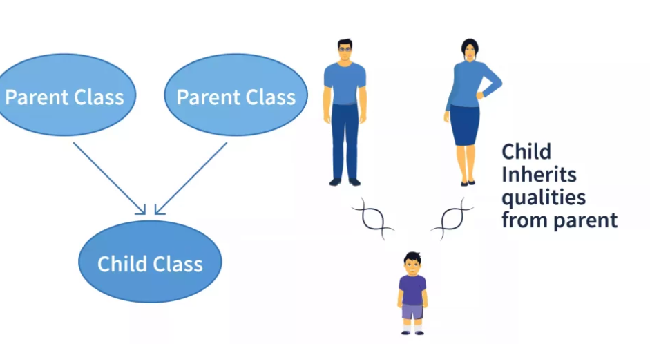

---
jupyter:
  kernelspec:
    display_name: Python 3
    language: python
    name: python3
  language_info:
    codemirror_mode:
      name: ipython
      version: 2
    file_extension: .py
    mimetype: text/x-python
    name: python
    nbconvert_exporter: python
    pygments_lexer: ipython2
    version: 2.7.6
  nbformat: 4
  nbformat_minor: 0
---

> \# Object-Oriented Programming In Python : By
>
> ### Alpha Omar Leigh and Alpha Alimammy Kamara
>
> #### Limkokwing University
>
> ## \#### Lecture 1 : Introduction to Object-Oriented Programming {#-lecture-1--introduction-to-object-oriented-programming}
:::

::: {.cell .markdown collapsed="false"}
# Lecture Notes: Introduction to Object-Oriented Programming (OOP)

## Table of Contents

1.  [Introduction](#i-introduction)
2.  [Historical Context](#ii-historical-context)
3.  [Core Concepts of OOP](#iii-core-concepts-of-oop)
    1.  [Classes and Objects](#1-classes-and-objects)
    2.  [Encapsulation](#2-encapsulation)
    3.  [Inheritance](#3-inheritance)
    4.  [Polymorphism](#4-polymorphism)
4.  [Advantages of OOP](#iv-advantages-of-oop)
    1.  [Modularity and Reusability](#1-modularity-and-reusability)
    2.  [Abstraction and Flexibility](#2-abstraction-and-flexibility)
    3.  [Maintainability and
        Scalability](#3-maintainability-and-scalability)
    4.  [Collaborative Development](#4-collaborative-development)
5.  [Functional Programming vs. OOP](#v-functional-programming-vs-oop)
6.  [Scenario Examples](#vi-scenario-examples)
    1.  [Banking System](#1-banking-system)
    2.  [Online Shopping Platform](#2-online-shopping-platform)
7.  [Conclusion](#vii-conclusion)

## Lesson Objectives

-   Understand the historical context and evolution of Object-Oriented
    Programming (OOP).
-   Explain the core concepts of OOP, including classes, objects,
    encapsulation, inheritance, and polymorphism.
-   Discuss the advantages of OOP in software development, such as
    modularity, reusability, and maintainability.
-   Differentiate between Functional Programming and OOP.
-   Explore practical scenario examples of OOP in action.
-   Recognize the significance of OOP in modern software development.

## I. Introduction {#i-introduction}

-   Object-Oriented Programming (OOP) is a groundbreaking programming
    paradigm that revolutionized the landscape of software development.
    It introduced a profound shift in how programmers approach
    problem-solving and code organization, leading to more efficient and
    maintainable software systems.

-   Traditional procedural programming, while effective for smaller
    programs, struggled to cope with the complexity of managing larger
    software projects. As systems grew in size and scope, procedural
    code became harder to understand, modify, and maintain. This
    challenge prompted the need for a new approach that could handle
    this complexity in a more organized manner.

-   OOP emerged in the late 1960s and early 1970s as a direct response
    to these challenges. It proposed a radical departure from the
    linear, top-to-bottom execution of procedural programming. Instead,
    OOP introduced the idea of encapsulating data and behavior within
    self-contained units called \"objects.\" These objects could be
    manipulated and interacted with, mimicking real-world entities and
    their relationships.

**Example:** Consider a simulation of a car manufacturing process. In a
procedural paradigm, you might have functions for assembling each car
part, leading to a cluttered and tangled codebase. In OOP, you would
define a `Car` class that encapsulates the properties (attributes) and
actions (methods) of a car. Each individual car in the simulation
becomes an instance of the `Car` class. This approach provides a clear
structure, making it easier to manage, modify, and extend the
simulation.

-   The introduction of objects and classes in OOP provided a natural
    way to model real-world entities and their interactions. Concepts
    like abstraction, inheritance, and polymorphism further enhanced the
    ability to design software systems that accurately mirrored the
    complexities of the real world.

-   OOP\'s influence has been profound, with its principles being
    adopted in various programming languages and frameworks. By
    understanding OOP, developers gain a powerful toolkit for creating
    adaptable, scalable, and maintainable software solutions, aligning
    their code with the dynamic nature of modern applications.

## II. Historical Context {#ii-historical-context}

-   **Procedural Programming:** Prior to OOP, programming was mainly
    done using procedural languages like Fortran and COBOL. These
    languages focused on organizing code as a sequence of procedures or
    functions.
-   **Simula:** In the 1960s, Ole-Johan Dahl and Kristen Nygaard
    developed Simula, a programming language that introduced the concept
    of classes and objects. It laid the foundation for OOP.
-   **Smalltalk:** In the 1970s, Alan Kay and his team at Xerox PARC
    created Smalltalk, a pure OOP language that heavily influenced
    modern OOP languages like Java and C++.
-   **C++:** Bjarne Stroustrup developed C++ in the early 1980s by
    adding object-oriented features to the C programming language. C++
    combined OOP with the efficiency of C.
-   **Java:** In the mid-1990s, James Gosling and his team at Sun
    Microsystems created Java, a versatile and platform-independent
    language that popularized OOP for enterprise and web applications.

## III. Core Concepts of OOP {#iii-core-concepts-of-oop}

### 1. Classes and Objects {#1-classes-and-objects}

-   ### 1. Classes and Objects {#1-classes-and-objects-1}

-   A **class** serves as a fundamental building block of
    Object-Oriented Programming. Think of it as a blueprint or template
    that describes the structure and behavior of objects. Classes
    encapsulate both data attributes and the methods that operate on
    that data.

**Example:** Imagine you\'re designing a software system for managing a
library. You might create a `Book` class that defines the attributes of
a book, such as its title, author, and publication year. Additionally,
you can include methods like `borrowBook()` and `returnBook()` to
manipulate the book\'s state.

-   An **object** is an instance of a class, created based on the
    class\'s blueprint. It represents a concrete realization of the
    abstract structure defined by the class. Objects have their own
    unique data and can execute the methods defined by their class.
-    
-   

**Example:** Using the `Book` class from the previous example, you can
create objects representing specific books in the library. For instance,
you could create an object `book1` based on the `Book` class, setting
its attributes (title, author, publication year) to match a particular
book in the library\'s collection. Similarly, you can create another
object `book2` with different attributes, representing a different book.
[]{.image .placeholder original-image-src="images/obj2.PNG"
original-image-title=""}

-   The class-object relationship provides a powerful mechanism for
    designing modular and reusable code. Instead of duplicating code for
    each individual entity, you define the class structure once and then
    create multiple instances (objects) that adhere to that structure.
    This approach not only simplifies code maintenance but also allows
    you to model complex real-world systems more accurately.

**Example:** In a game development scenario, you might have a
`Character` class that defines common attributes like health and
abilities. By creating instances of this class, you can easily generate
different characters within the game, each with its own unique
attributes and behaviors.

-   Overall, the distinction between classes and objects forms the core
    foundation of Object-Oriented Programming. Classes provide the
    blueprint, while objects bring that blueprint to life, enabling
    developers to model and manipulate a wide range of entities and
    scenarios in their software systems.

### 2. Encapsulation {#2-encapsulation}

-   **Encapsulation** is a key principle in Object-Oriented Programming
    that revolves around bundling data and methods that manipulate that
    data within a single unit, which is typically a class. This
    encapsulated unit acts as a protective barrier, controlling how the
    internal state of an object can be accessed and modified from
    outside.
-   

**Example:** Consider a `BankAccount` class that encapsulates
information about a customer\'s bank account, such as the account
balance. The balance data should not be directly accessible or
modifiable from external sources. Instead, you might provide methods
like `deposit()` and `withdraw()` that allow controlled access to modify
the balance. This encapsulation prevents unauthorized changes to the
account balance and ensures that changes are made through well-defined
methods.

-   Encapsulation promotes data integrity by preventing unintended or
    incorrect modifications to an object\'s internal state. It enforces
    a clear separation between the implementation details (data
    attributes) and the ways that data can be manipulated (methods).

**Example:** Imagine a `Student` class that encapsulates a student\'s
personal information, including their date of birth. By encapsulating
the date of birth attribute and providing a method to calculate the
student\'s age, you ensure that the age is always accurate and
up-to-date, regardless of how the birthdate is stored internally.

-   Beyond data protection, encapsulation also enhances code
    maintainability. If changes need to be made to the internal
    implementation of a class (e.g., changing how data is stored),
    encapsulation allows you to update the internal details without
    affecting the external code that interacts with the class.

**Example:** Consider a `TemperatureSensor` class used in a weather
monitoring application. If you decide to switch to a different sensor
technology, you can modify the internal implementation of the class
without altering the code that uses the sensor\'s data, thanks to
encapsulation.

-   In summary, encapsulation ensures that the complexity of an
    object\'s internal workings remains hidden, providing a controlled
    interface for interacting with the object. This principle enhances
    code reliability, security, and maintainability, making it a
    fundamental pillar of Object-Oriented Programming.

### 3. Inheritance {#3-inheritance}

-   **Inheritance** is a powerful concept in Object-Oriented Programming
    that enables a class (called a subclass or derived class) to inherit
    attributes and methods from another class (called a superclass or
    base class). This mechanism encourages code reuse by allowing you to
    build upon existing classes, creating more specialized versions with
    additional features.
-   
    

**Example:** Consider a `Shape` class that defines basic properties like
color and position. You can create subclasses like `Circle` and
`Rectangle` that inherit attributes from the `Shape` class. These
subclasses can then add their own unique properties and methods specific
to circles and rectangles, while still inheriting common behavior from
the base `Shape` class.

-   

-   Inheritance establishes a hierarchy among classes, where more
    specific classes (subclasses) inherit traits from more general
    classes (superclasses). This hierarchy not only promotes code reuse
    but also enhances code organization and understanding.

**Example:** Imagine a software system for managing various types of
vehicles. You might have a `Vehicle` superclass that includes attributes
like `speed` and `fuelLevel`. Subclasses like `Car` and `Motorcycle` can
inherit these attributes while adding their own features, like the
number of doors for a car and the type of engine for a motorcycle.

### 4. Polymorphism {#4-polymorphism}

-   **Polymorphism** is a powerful concept that allows objects of
    different classes to be treated as objects of a common superclass.
    This flexibility enables you to write code that can work with
    different types of objects without needing to know their exact
    class.
-   

**Example:** Consider a `Shape` superclass with a common method
`calculateArea()`. Subclasses like `Circle` and `Rectangle` can
implement their versions of `calculateArea()` based on their specific
formulas. In the code, you can create a list of various shapes (circles,
rectangles) and iterate through them, calling the same `calculateArea()`
method. Polymorphism ensures that the appropriate version of the method
is invoked based on the actual object type.

-   Polymorphism also allows you to define a common interface that
    multiple classes adhere to. This interface consists of method names
    that participating classes must implement, even if the
    implementations vary.

**Example:** Consider an interface `Drawable` with a method `draw()`.
Both a `Circle` class and a `Rectangle` class can implement the
`Drawable` interface and provide their own implementations of the
`draw()` method. This allows you to treat both circles and rectangles as
drawable objects, regardless of their specific implementations.

-   In summary, polymorphism enhances code flexibility by allowing you
    to write code that works with a variety of objects while maintaining
    a clear and consistent interface. This principle is especially
    valuable when dealing with complex systems and dynamic scenarios.

## IV. Advantages of OOP {#iv-advantages-of-oop}

### 1. Modularity and Reusability {#1-modularity-and-reusability}

-   OOP encourages code modularity, allowing developers to divide
    complex systems into manageable components (classes).
-   Objects can be reused in different projects, saving development time
    and effort.

### 2. Abstraction and Flexibility {#2-abstraction-and-flexibility}

-   Abstraction simplifies complex systems by focusing on essential
    features while hiding unnecessary details.
-   OOP provides flexibility through polymorphism, allowing
    interchangeable components.

### 3. Maintainability and Scalability {#3-maintainability-and-scalability}

-   Encapsulation and well-defined interfaces make code easier to
    maintain and extend without disrupting other parts of the system.
-   Changes can be localized to specific classes, reducing the risk of
    introducing bugs.

### 4. Collaborative Development {#4-collaborative-development}

-   OOP\'s structured design promotes collaboration among developers, as
    different team members can work on separate classes concurrently.

## V. Functional Programming vs. OOP {#v-functional-programming-vs-oop}

When exploring programming paradigms, it\'s important to understand the
differences between **Functional Programming** and **Object-Oriented
Programming (OOP)**. These two paradigms offer distinct approaches to
structuring and solving problems in software development.

### Functional Programming

-   **Functional Programming (FP)** is a paradigm that treats
    computation as the evaluation of mathematical functions. It
    emphasizes immutability, where data structures are not modified once
    created, and declarative programming, where the focus is on
    expressing what should be done rather than how it should be done.

**Example:** In a functional program, you might define a function to
calculate the factorial of a number. This function takes an input and
produces an output without altering any external state. The immutability
principle ensures that the input remains unchanged throughout the
computation.

-   FP promotes the use of higher-order functions, which are functions
    that can take other functions as arguments or return them as
    results. This enables the creation of concise and expressive code.

**Example:** In FP, you can use a higher-order function like `map` to
transform elements in a list. Instead of writing explicit loops, you
pass a transformation function to `map`, which applies the function to
each element in the list.

### Object-Oriented Programming (OOP)

-   **OOP** centers around modeling real-world entities and their
    interactions as objects. It emphasizes encapsulation, which bundles
    data and methods into a single unit, inheritance, which promotes
    code reuse, and polymorphism, which enables interchangeable behavior
    through common interfaces.

**Example:** Imagine a simulation of a zoo. OOP allows you to create
classes like `Animal`, `Bird`, and `Mammal`, each with their own
attributes and methods. You can then create specific instances of these
classes to represent individual animals in the zoo.

-   OOP is well-suited for modeling systems with complex interactions
    and hierarchies. It provides a structured and intuitive way to
    represent entities and their relationships.

**Example:** In a game development scenario, OOP allows you to create
classes like `Player`, `Enemy`, and `Item`. These classes can inherit
common attributes and methods from a shared superclass, promoting code
reuse. Additionally, polymorphism allows you to use a uniform interface
for interacting with different types of game entities.

### Choosing the Right Paradigm

The choice between FP and OOP depends on the problem at hand and the
programming style you prefer. Functional programming excels in scenarios
where immutability and declarative expressions are essential, such as in
mathematical computations or data processing. OOP shines when dealing
with complex systems that involve interactions between different
entities.

Ultimately, both paradigms have their strengths and can complement each
other. Developers often combine elements from both paradigms to create
well-structured and efficient software solutions that address a wide
range of challenges.

## VI. Scenario Examples {#vi-scenario-examples}

### 1. Banking System {#1-banking-system}

-   **Classes:** `Account`, `Customer`, `Transaction`
-   **Objects:** `SavingsAccount`, `CheckingAccount`, `Customer1`,
    `Customer2`
-   **Encapsulation:** Hide account balance and provide methods for
    deposits and withdrawals.
-   **Inheritance:** Subclasses `SavingsAccount` and `CheckingAccount`
    inheriting from superclass `Account`.

### 2. Online Shopping Platform {#2-online-shopping-platform}

-   **Classes:** `Product`, `User`, `Order`
-   **Objects:** `Laptop`, `User1`, `User2`, `Order123`
-   **Polymorphism:** Different product types using a common method for
    calculating shipping cost.
-   **Abstraction:** Users interact with products and place orders
    without needing to know internal details.

## VII. Conclusion {#vii-conclusion}

-   Object-Oriented Programming (OOP) revolutionized software
    development by introducing the concepts of classes and objects,
    encapsulation, inheritance, and polymorphism.
-   Its historical evolution, advantages, and scenarios showcase its
    importance in building modular, maintainable, and scalable software
    systems.
-   OOP is a versatile paradigm used in languages like Java, C++, and
    Python, enabling developers to model real-world entities
    effectively.

By understanding and applying OOP principles, you\'ll be well-equipped
to design and build robust software systems that meet the demands of
modern applications.
:::

::: {.cell .markdown collapsed="false"}
## Review Questions:

1.  Define Object-Oriented Programming (OOP) and explain how it
    revolutionized software development.
2.  What historical challenges in software development prompted the
    emergence of OOP?
3.  Describe the core concepts of OOP: classes, objects, encapsulation,
    inheritance, and polymorphism.
4.  How does encapsulation contribute to code security and
    maintainability?
5.  Compare and contrast Functional Programming and OOP in terms of
    their principles and advantages.
:::

::: {.cell .markdown collapsed="false"}
# Quiz: Introduction to Object-Oriented Programming (OOP)

### Question 1

What is the purpose of a class in Object-Oriented Programming?

-   a\) To store data
-   b\) To define a blueprint for creating objects
-   c\) To perform mathematical computations
-   d\) To manage input/output operations

### Question 2

Inheritance is a concept in OOP that allows:

-   a\) Objects to inherit attributes from other objects
-   b\) Classes to inherit attributes and methods from other classes
-   c\) Objects to be created without classes
-   d\) Methods to inherit properties from other methods

### Question 3

What is the primary benefit of polymorphism in OOP?

-   a\) It allows for the creation of multiple classes
-   b\) It simplifies the process of data encapsulation
-   c\) It enables objects of different classes to share common behavior
-   d\) It ensures immutability of data attributes

### Question 4

Which programming paradigm emphasizes treating computation as the
evaluation of mathematical functions?

-   a\) Object-Oriented Programming
-   b\) Functional Programming
-   c\) Procedural Programming
-   d\) Imperative Programming

### Question 5

How does encapsulation contribute to code maintainability in OOP?

-   a\) It allows for direct modification of object attributes
-   b\) It hides implementation details of a class
-   c\) It prevents the use of methods in a class
-   d\) It promotes global access to data attributes

### Question 6

What is an example of a real-world scenario that can be modeled using
OOP?

-   a\) Solving mathematical equations
-   b\) Organizing a grocery list
-   c\) Simulating a zoo with different animals
-   d\) Creating a simple calculator

### Question 7

Which principle of OOP ensures that an object\'s internal state is
protected from unauthorized access?

-   a\) Inheritance
-   b\) Encapsulation
-   c\) Polymorphism
-   d\) Abstraction

### Question 8

Functional Programming emphasizes:

-   a\) Using loops and iterative constructs
-   b\) Modifying data in-place
-   c\) Treating computation as mathematical functions
-   d\) Avoiding the use of functions

### Question 9

In OOP, polymorphism allows objects of different classes to:

-   a\) Merge their attributes
-   b\) Access private methods
-   c\) Be created without using a class
-   d\) Be treated as objects of a common superclass

### Question 10

Which programming paradigm is more suitable for systems with complex
interactions and hierarchies?

-   a\) Procedural Programming
-   b\) Declarative Programming
-   c\) Functional Programming
-   d\) Object-Oriented Programming
:::

::: {.cell .markdown collapsed="false"}

------------------------------------------------------------------------

**References:**

1.  Lecture notes: Introduction to Object-Oriented Programming (OOP)
2.  "Object-Oriented Programming (OOP) Concepts\" - Oracle,
    [link](https://docs.oracle.com/javase/tutorial/java/concepts/index.html)
3.  "Functional Programming\" - HaskellWiki,
    [link](https://wiki.haskell.org/Functional_programming)
