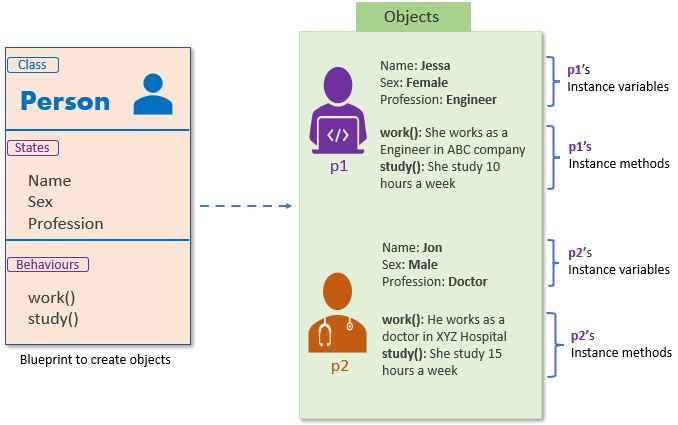
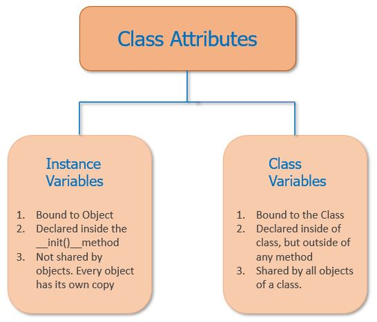

>    # Object-Oriented Programming In Python :  By
> ### Alpha Omar Leigh and Alpha Alimammy Kamara
> #### Limkokwing University
> #### Lecture 1 : Introduction to Object-Oriented Programming
---

**In this training , you will learn how to:**
• Create a class, which is like a blueprint for creating an object
• Use classes to create new objects
• Encapsulation

## Define a Class
> Think of data structures as containers that hold different kinds of information. Simple ones, like numbers, strings (text), and lists (collections of things), can represent basic stuff like costs, poem names, and favorite colors. But what if you need to handle more complex things?

>Imagine you're a student working on a project about your university's members. You want to organize details about each student in a neat way. You'd need to store important info like their name, age, field of study, and the year they joined the university. These details are more intricate than just numbers or words, so you need a smarter way to arrange and manage them. That's where more advanced data structures come into play.
Here's a way to organize information about students in a clear manner:
You can think of each student as a bundle, like a package with various labels. For instance, let's consider a few students at your university:

```python
student1  = ["John Bull", 84, "BSEM", 2265]
student12 = ["Mary Bull",  "BBIT", 2254, 95]
student3 = ["Konky Bull", "DIT", 2266]
```

>There are a number of issues with this approach. First, when you reference student1 [0] several lines away from where the student2 list is declared, will you remember that the 0th element of the list is the student’s name? What if not every student1  has the same number of elements in the list?

>Second, in the mccoy list above, the age is missing, so student2 [1] will return "BBIT " instead of student1  age. A great way to make this type of code more manageable and more maintainable is to use classes

# Classes vs Instances
Classes are used to create user-defined data structures. Classes also have special functions, called methods, that define behaviors and actions that an object created from the class can perform with its data. In this chapter you’ll create a Dog class that stores some basic information about a dog.
It’s important to note that a class just provides structure. A class is a blueprint for how something should be defined. It doesn’t actually provide any real content itself. The Dog class may specify that the name and age are necessary for defining a dog, but it will not actually state what a specific dog’s name or age is.
While the class is the blueprint, an instance is an object built from a class that contains real data. An instance of the Dog class is not a blueprint anymore. It’s an actual dog with a name, like Miles, who’s four years old. Put another way, a class is like a form or questionnaire. It defines the needed information. After you fill out the form, your specific copy is an instance of the class. It contains actual information relevant to you.
You can fill out multiple copies of a form to create many instances, but without the form as a guide, you would be lost, not knowing what information is required. Thus, before you can create individual instances of an object, you must first specify what is needed by defining a class.
In short, Every object has the following property.

Identity: Every object must be uniquely identified.
State: An object has an attribute that represents a state of an object, and it also reflects the property of an object.
Behavior: An object has methods that represent its behavior.

Python is an Object-Oriented Programming language, so everything in Python is treated as an object. An object is a real-life entity. It is the collection of various data and functions that operate on those data.

For example, If we design a class based on the states and behaviors of a Person, then States can be represented as instance variables and behaviors as class methods.


# ***How to Define a Class***
All class definitions start with the ***class*** keyword, which is followed by the name of the class and a colon. This is similar to the signature  of a function, except that you don’t need to add any parameters in parentheses. Any code that is indented below the class definition is considered part of the class’s body.
Here is an example of a simple Dog class:
# Syntax of Creating a Class

```
class class_name:
    """This is a docstring. Ihave created a new class"""
    '''
    <statement 1>
    <statement 1>
    <statement 1>
    .
    .
    <statement N>
    '''
```


```python
class ClassName:
    # Class body
    pass
```


```python
class Dog:
    pass
```

The body of the Dog class consists of a single statement: the ***pass*** keyword. ***pass*** is often used as a placeholder where code will eventually go. It allows you to run this code without throwing an error.

### Note
Unlike functions and variables, the convention for naming
classes in Python is to use CamelCase notation, starting with
a capital letter. For example, a class for a specific name
of a person , like the ***Alpha Alimammy Kamara***, would be written as
***AlphaAlimammyKamara***
.

## Initializations in Python
Constructors in Python are special methods that are automatically invoked when an object of a class is created. They are used to initialize the attributes or properties of an object. Constructors are defined using the __init__() method within a class. Here's a basic example of how constructors work in Python:


```python
class MyClass:
    def __init__(self, param1, param2):
        self.attribute1 = param1
        self.attribute2 = param2
```

In this example, the __init__() method is the constructor of the MyClass class. It takes self as its first parameter, which refers to the instance of the class being created. Additional parameters (param1 and param2 in this case) are used to pass values during object creation. Inside the constructor, these values are assigned to object attributes (attribute1 and attribute2).

Constructors allow you to perform any setup or initialization that is required for objects of a class when they are created. They help ensure that objects start with appropriate initial states.

The Dog class isn’t very interesting right now, so let’s spruce it up a bit by defining some properties that all Dog objects should have. There are a number of properties that we can choose from, such as name, age, coat color, and breed. To keep things simple, we’ll stick with just two for now: name and age. To define the properties, or instance attributes, that all Dog objects must have, you need to define a special method called .__init__(). This method is run every time a new Dog object is created and tells Python what the initial state—that is, the initial values of the object’s properties—of the object should be.

The first positional argument of .__init__() is always a variable that references the class instance. This variable is almost universally named self. After the self argument, you can specify any other arguments required to create an instance of the class. The following updated definition of the Dog class shows how to write an .__init__() method that creates two instance attributes: .name and .age:


```python
class Dog:
    def __init__(self, name, age):
        self.name = name
        self.age = age


```

Notice that the function signature—the part that starts with the def keyword—is indented four spaces. The body of the function is indented by eight spaces. This indentation is vitally important. It tells Python that the .__init__() method belongs to the Dog class. Without the indentation, Python would treat __init__() as just another function.

Note : Functions that belong to a class are called instance methods because they belong to the instance of a class. For example, list.append() and string.find() are instance methods.

In the body of the .__init__() method, there are two statements using the self variable. The first line, self.name = name, creates an instance attribute called name and assigns to it the value of the name variable that was passed to the .__init__() method. The second line creates an instance attribute called age and assigns to it the value of the age argument.
This might look kind of strange. The self variable is referring to an instance of the Dog class, but we haven’t actually created an instance yet.
 It is a place holder that is used to build the blueprint. Remember, the class is used to define the Dog data structure. It does not actually create any instances of individual dogs with specific names and ages.
While instance attributes are specific to each object, class attributes are the same for all instances—which in this case is all dogs. In the next example, a class attribute called species is created and assigned the value "Canis familiaris":


```python

```

Class attributes are defined directly underneath the first line of the class and outside of any method definition. They must be assigned a value because they are created on a class instance without arguments to determine what their initial value should be.
You should use class attributes whenever a property should have the same initial value for all instances of a class. Use instance attributes for properties that must be specified before an instance is created. Now that we have a Dog class, let’s create some dogs!


```python
# Example 1: Let create a Class Circle and initialize it radius and create a method called calculate_area by using the math module to have access to pi
```

# Instantiate an Object
Once a class has been defined, you have a blueprint for creating—also known as instantiating—new objects. The action of creating concrete objects from an existing class is known as instantiation. With every instantiation, you create a new object of the target class.
## Syntax of creating an object from a class
```
<object-name> = <class-name>(<arguments>)
```


```python
buddy = Dog("Buddy", 9)
miles = Dog("Miles", 4)

```

After declaring the new Dog class, two new instances are created—one Dog whose name is Buddy and is nine years old, and another named Miles who is four years old.
Does anything look a little strange about how the Dog objects are instantiated? The .__init__() method has three parameters, so why are only two arguments passed to it in the example?
When you instantiate a Dog object, Python creates a new instance and passes it to the first parameter of .__init__(). This essentially removes the self parameter, so you only need to worry about the name and age parameters. After the Dog instances are created, you can access their instance attributes by using dot notation:


```python
buddy.name
```


    'Buddy'


```python
miles.name
```


    'Miles'


<!-- headings -->
<a id="item-three"></a>
### Class Attributes

When we design a class, we use instance variables and class variables.

In Class, attributes can be defined into two parts:

**Instance variables**: The instance variables are attributes attached to an instance of a class. We define instance variables in the constructor ( the __init__() method of a class).An instance is a variable that you define inside a method. Instance attributes belong to a concrete instance of a given class. Their data is only available to that instance and defines its state.
**Class Variables**: A class variable is a variable that is declared inside of class, but outside of any instance method or __init__() method.
 A class attribute is a variable that you define in the class body directly. Class attributes belong to their containing class. Their data is common to the class and all its instances.

Both types of attributes have their specific use cases. Instance attributes are, by far, the most common type of attribute that you’ll use in your day-to-day coding, but class attributes also come in handy.



```python
class Dog:
   # Class Attribute
   species = "Canis familiaris"

   def __init__(self, name, age):
        self.name = name
        self.age = age
```
Class attributes are accessed the same way:

```python
buddy.species
```
One of the biggest advantages of using classes to organize data is that
instances are guaranteed to have the attributes you expect:

```python
buddy.species == miles.species
```
Both buddy and miles have the .species attribute. Contrast this to the
method of using lists to represent similar data structures that you saw
at the beginning of the previous section. With a class you no longer
have to worry that an attribute may be missing.
Both instance and class attributes can be modified dynamically:

```python
buddy.age = 12
buddy.age
```


```python
miles.species = "Felis silvestris"
miles.species
```

In this example, the .age attribute of the buddy object is changed to 10. Then the .species attribute of the miles object is changed to "Felis silvestris", which is a species of cat. That makes Miles a pretty strange dog, but it is valid Python! The important takeaway here is that custom objects are mutable by default. Recall that an object is mutable if it can be altered dynamically. For example, lists and dictionaries are mutable, but strings and tuples are not—they are immutable. Now that you know the difference between a class and an instance, how to create instances and set class and instance attributes, the next step is to look at instance methods in more detail.


## Instance Attributes
Instance attributes are variables tied to a particular object of a given class. The value of an instance attribute is attached to the object itself. So, the attribute’s value is specific to its containing instance.

Python lets you dynamically attach attributes to existing objects that you’ve already created. However, you most often define instance attributes inside instance methods, which are those methods that receive self as their first argument.

Note: Even though you can define instance attributes inside any instance method, it’s best to define all of them in the .__init__() method, which is the instance initializer. This ensures that all of the attributes have the correct values when you create a new instance. Additionally, it makes the code more organized and easier to debug.


```python
# Consider the following Car class, which defines a bunch of instance attributes:
class Car:
    def __init__(self, make, model, year, color):
        self.make = make
        self.model = model
        self.year = year
        self.color = color
        self.started = False
        self.speed = 0
        self.max_speed = 200
```

# Instance Methods
Instance methods are functions defined inside of a class. This means that they only exist within the context of the object itself and cannot be called without referencing the object. Just like .__init__(), the first argument of an instance method is always self:


```python
class Dog:
    species = "Canis familiaris"
    def __init__(self, name, age):
        self.name = name
        self.age = age
    # Instance method
    def description(self):
        return f"{self.name} is {self.age} years old"
    # Another instance method
    def speak(self, sound):
        return f"{self.name} says {sound}"
```

In this example, two new instance methods are defined:
1. description() returns a string displaying the name and age of the dog
2. speak() has one parameter called sound and returns a string containing the dog’s name and the sound the dog makes
Let’s see how instance methods work in practice. To avoid typing out the whole class in the interactive window, you can save the modified Dog class in a script in IDLE and run it.


```python
miles = Dog("Miles", 4)
```


```python
miles.description()
```


```python
miles.speak("woof woof")
```


```python
miles.speak("Bow Bow")
```

The .description() method defined in the above Dog class returns a string containing information about the Dog instance miles. When writing your own classes, it is a good idea to have a method that returns a string containing useful information about an instance of the class.
However, .description() isn’t the most Pythonic way of doing this.
When you create a list object, you can use the print() function to display a string that looks like the list:


```python
names = ["Fletcher", "David", "Dan"]
print(names)
```


```python
print(miles)
```

When you print(miles), you get a cryptic looking message telling you that miles is a Dog object at 0x00aeff70. The number 0x00aeff70 is the address of this Dog object in your computer’s memory, and the number you see on your computer will be different. The message displayed by print(miles) isn’t very helpful. You can change what gets printed by defining a special instance method called .__str__(). Let’s change .description() to .__str__() in the Dog class:

## Special Methods and Protocols
Python supports what it calls special methods, which are also known as dunder or magic methods. These methods are typically instance methods, and they’re a fundamental part of Python’s internal class mechanism. They have an important feature in common: Python calls them automatically in response to specific operations.

Python uses these methods for many different tasks. They provide a great set of tools that will allow you to unlock the power of classes in Python.

You’ll recognize special methods because their names start and end with a double underscore, which is the origin of their other name, dunder methods (double underscore). Arguably, .__init__() is the most common special method in Python classes. As you already know, this method works as the instance initializer. Python automatically calls it when you call a class constructor.

You’ve already written a couple of .__init__() methods. So, you’re ready to learn about other common and useful special methods. For example, the .__str__() and .__repr__() methods provide string representations for your objects.


```python
class Dog:
    species = "Canis familiaris"
    def __init__(self, name, age):
        self.name = name
        self.age = age
    # Instance method
    def description(self):
        return f"{self.name} is {self.age} years old"
    # Another instance method
    def speak(self, sound):
        return f"{self.name} says {sound}"
    def __str__(self):
        return self.name
```

## Access specifiers  and encapsulations
In Python, access specifiers and encapsulation are mechanisms that control the visibility and accessibility of class attributes and methods. They help in implementing data hiding and ensuring that the internal implementation details of a class are not exposed directly to the outside world. However, Python uses a more relaxed approach to access control compared to languages like Java or C++.

Access Specifiers:
Python uses naming conventions to indicate the intended visibility of class members. There are three main access specifiers in Python:

Public: Attributes and methods that are not prefixed with an underscore are considered public and can be accessed from anywhere, both within and outside the class.

Protected: Attributes and methods that are prefixed with a single underscore are considered protected. While they can still be accessed from outside the class, this naming convention indicates that they are intended for internal use within the class or its subclasses.

Private: Attributes and methods that are prefixed with two underscores are considered private. They are not accessible from outside the class. However, it's important to note that Python does not enforce true private access; these members can still be accessed using a name mangling convention (_ClassName__member).


```python
class MyClass:
    def __init__(self):
        self.public_attr = "This is a public attribute"
        self._protected_attr = "This is a protected attribute"
        self.__private_attr = "This is a private attribute"

obj = MyClass()
print(obj.public_attr)       # Public attribute
print(obj._protected_attr)   # Protected attribute (convention)
print(obj._MyClass__private_attr)  # Private attribute (name mangling)
```


```python
class Dog:
    species = "Canis familiaris"
    def __init__(self, name, age):
        self.__name = name
        self.__age = age
    # Instance method
    def description(self):
        return f"{self.__name} is {self.__age} years old"
    # Another instance method
    def speak(self, sound):
        return f"{self.__name} says {sound}"
    def __str__(self):
        return self.__name

    # Getters
    def get_name(self):
        return self.__name
    def get_age(self):
        return self.__age
    # Setters
    def set_name(self, value):
        self.__name = value
    def set_age(self, value):
        self.__age= value
```


```python
class Dog:
    species = "Canis familiaris"
    def __init__(self, name, age):
        self.__name = name
        self.__age = age
    # Instance method
    def description(self):
        return f"{self.__name} is {self.__age} years old"
    # Another instance method
    def speak(self, sound):
        return f"{self.__name} says {sound}"
    def __str__(self):
        return self.__name

    # Getters
    @property
    def get_name(self):
        return self.__name
    @property
    def get_age(self):
        return self.__age
    # Setters
    @get_name.setter
    def set_name(self, value):
        self.__name = value
    @get_age.setter
    def set_age(self, value):
        self.__age= value
```
# Let model a car class

Car Class
Write a class named Car that has the following data attributes:
• _ _year_model (for the car’s year model)
• _ _make (for the make of the car)
• _ _speed (for the car’s current speed)
• _ _color
default values :
        started = False
        speed = 0
        max_speed = 200

The Car class should have an _ _init_ _ method that accepts the car’s year model and
make as arguments. These values should be assigned to the object’s _ _year_model and
_ _make data attributes. It should also assign 0 to the _ _speed data attribute.
The class should also have the following methods:
• accelerate
The accelerate method should add 5 to the speed data attribute each time it is called.
• brake
The brake method should subtract 5 from the speed data attribute each time it is called.
• get_speed
The get_speed method should return the current speed

```python
class Car:
     def __init__(self, model, make, speed, color):
         # Instance attributes
         self.__car_model = model
         self.__car_make = make
         self.car_speed = speed
         self.car_color = color
         self.started = False
         self.max_speed = 200

     def get_car_speed(self):
         return self.car_speed

     def set_car_speed(self, value):
         self.car_speed = value
     def accelerate(self):
         if self.started:
             print("You should start the car")
         if self.car_speed + 5 > self.max_speed:
             self.car_speed = self.max_speed
         else :
             self.car_speed += 5
         print(f"Accelerating at {self.car_speed} km/hr....")
     def brake(self):
         if self.car_speed - 5 < 0:
            self.car_speed = 0
         else:
             self.car_speed -= 5
     def  __str__(self):
            return (
                f"Car Make : {self.car_make} \n"
                f"Car Model : {self.car_model} \n"
                f"Car Color : {self.car_color} \n"
                f"Car Speed : {self.car_speed}"
            )
```


```python
range = Car(2019, "Range Rover", 15, "Black")
```


```python
range.accelerate()
range.accelerate()
range.accelerate()
```

    Accelerating at 20 km/hr....
    Accelerating at 25 km/hr....
    Accelerating at 30 km/hr....
    


```python
range.brake()
range.brake()
print(range)
```

    Car Make : Range Rover 
    Car Model : 2019 
    Car Color : Black 
    Car Speed : 10
    


```python
ford = Car(2555, "fff", 34, 'red')
```


```python
ford.
```


```python
class Dog:
    species = "Canis familiaris"
    def __init__(self, name, age):
        self.name = name
        self.age = age
    # Instance method
    # def description(self):
    #     return f"{self.name} is {self.age} years old"
    # Replace .description() with __str__()
    def __str__(self):
        return f"{self.name} is {self.age} years old"

    def __repr__(self):
        return (
            f"{type(self).__name__}"
            f"(name={self.name})"

        )
    # Another instance method
    def speak(self, sound):
        return f"{self.name} says {sound}"
```


```python
java = Dog("Java", 5)
print(java)
```

Note Methods like .__str__() are commonly called dunder methods because they begin and end with double underscores. There are a number of dunder methods available that allow your classes to work well with other Python language features. Dunder methods are powerful and are an important part of mastering OOP in Python, but we won’t go into detail here.

You should now have a pretty good idea of how to create a class that stores some data and provides some methods to interact with that data and define behaviors for an object.

## Execise 1 : Student Class
Design a class named Student with the following data attributes:
• _ _name (for the student's name)
• _ _student_id (for the student's identification number)
• _ _major (for the student's major field of study)
The Student class should feature an _ init _ method to initialize these attributes. Develop the following methods:
• set_name: Set the value of the _ _name field.
• set_student_id: Assign a value to the _ _student_id field.
• set_major: Assign a value to the _ _major field.
• get_name: Retrieve the value of the _ _name field.
• get_student_id: Retrieve the value of the _ _student_id field.
• get_major: Retrieve the value of the _ _major field.

## Execise 2 Bank Account Class
Design a class named BankAccount with the following attributes:
• _ _account_number (for the account number)
• _ _holder_name (for the account holder's name)
• _ _balance (for the account balance)
Create an _ init _ method to initialize these attributes. Implement the following methods:
• deposit: This method should add a specified amount to the balance.
• withdraw: This method should subtract a specified amount from the balance.
• get_balance: Return the account balance.
Write a program that creates a BankAccount object and performs a series of deposits and withdrawals. Display the balance after each operation.

## Exercise 3 Employee Class
Create a class named Employee with the following attributes:
• _ _employee_id (for the employee's identification number)
• _ _name (for the employee's name)
• _ _position (for the employee's job position)
The Employee class should have an _ init _ method to initialize these attributes. Develop the following methods:
• set_employee_id: Set the value of the _ _employee_id field.
• set_name: Set the value of the _ _name field.
• set_position: Set the value of the _ _position field.
• get_employee_id: Retrieve the value of the _ _employee_id field.
• get_name: Retrieve the value of the _ _name field.
• get_position: Retrieve the value of the _ _position field.
Write a program that creates an Employee object and updates its attributes using the provided methods. Display the employee's information after the updates.

## Execise 4 : Book Class
Write a class named Book with the following attributes:
• _ _title (for the book's title)
• _ _author (for the book's author)
• _ _isbn (for the book's ISBN number)
The Book class should include an _ init _ method to initialize these attributes. Additionally, implement the following methods:
• set_title: Set the value of the _ _title field.
• set_author: Set the value of the _ _author field.
• set_isbn: Set the value of the _ _isbn field.
• get_title: Retrieve the value of the _ _title field.
• get_author: Retrieve the value of the _ _author field.
• get_isbn: Retrieve the value of the _ _isbn field.
Develop a program that creates a Book object and uses the provided methods to modify and access its attributes. Display the book's details after the modifications.


```python

```
